# Gráficos de Barras Apiladas 

| (1) | (2) | (3) |
| :---: | :---: | :---: |
| 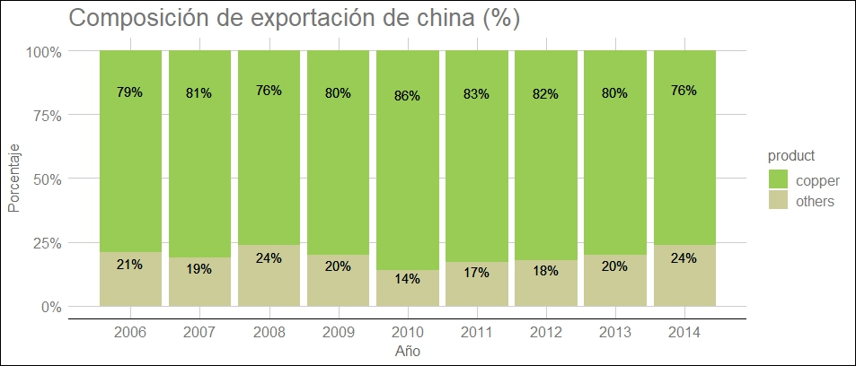 | 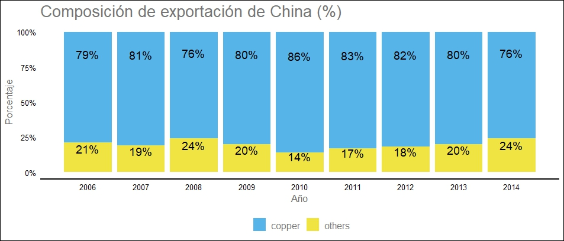 | 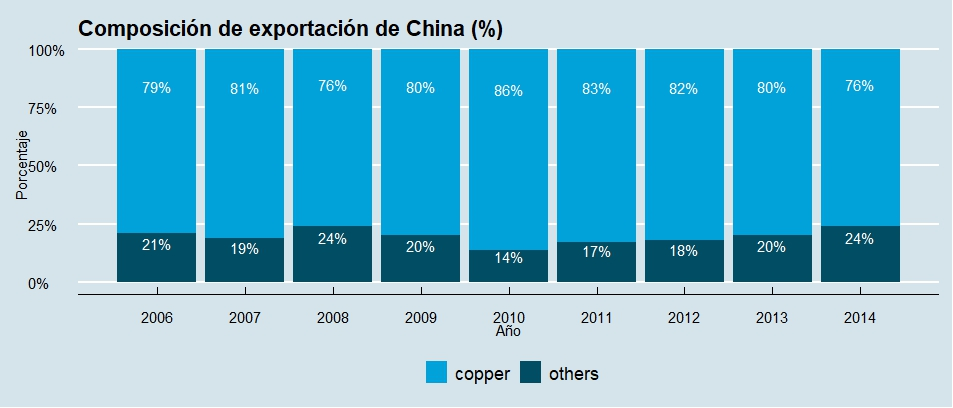 |

## Preparación de los datos

```r
Productos <- 
  utils::read.csv(
    file = "data/Productos.csv",
    sep = ';',
    header = TRUE)

Productos_new <- 
  plyr::ddply(
    .data = Productos, 
    .variables = plyr::.(year),
    .fun = base::transform, 
    pos = 100 - (cumsum(percentage) - (0.8 * percentage)))

# Obtener nuevas fuentes

if (!base::file.exists("./.fonts")){
  base::dir.create(path = "./.fonts")
}

utils::download.file(
  url = "http://simonsoftware.se/other/xkcd.ttf",
  dest = ".fonts/xkcd.ttf", 
  mode = "wb")
```

## Gráficos
```r
# (1)
colores <- c("#99CC55", "#CCCC99")

Productos_new |> 
  ggplot2::ggplot() + 
  ggplot2::geom_bar(
    mapping = ggplot2::aes(
      y = percentage, 
      x = year, 
      fill = product),
    stat = "identity") +
  ggplot2::geom_text(
    data = Productos_new, 
    mapping = ggplot2::aes(
      x = year, 
      y = pos, 
      label = base::paste0(percentage,"%")),
    size=4) + 
  ggplot2::geom_text(
    data = Productos_new, 
    mapping = ggplot2::aes(
      x = year, 
      y = pos, 
      label = base::paste0(percentage,"%")),
    size = 4) + 
  ggplot2::scale_x_continuous(breaks = base::seq(2006, 2014, 1)) + 
  ggplot2::labs(
    x = "Año", 
    y = "Porcentaje") +
  ggplot2::scale_y_continuous(
    labels = scales::dollar_format(
      suffix = "%", 
      prefix = "")) +
  ggplot2::ggtitle("Composición de exportación de china (%)") +
  ggplot2::scale_fill_manual(values = colores)

# (2)

extrafont::font_import(
  paths = "./.fonts/",
  pattern = ".*\\.ttf")

extrafont::fonts()
extrafont::loadfonts()

fill <- c("#56B4E9", "#F0E442")

Productos_new |> 
  ggplot2::ggplot() +
  ggplot2::geom_bar(
    mapping = ggplot2::aes(
      y = percentage, 
      x = year, 
      fill = product), 
    stat = "identity") +
  ggplot2::geom_text(
    data = Productos_new, 
    mapping = ggplot2::aes(
      x = year, 
      y = pos, 
      label = paste0(percentage,"%")),
    colour = "black", 
    family = "xkcd-Regular", 
    size = 5, 
    show.legend = F) +
  ggplot2::theme(
    legend.position = "bottom", 
    legend.direction = "horizontal",
    legend.title = ggplot2::element_blank()) +
  ggplot2::scale_x_continuous(breaks = seq(2006, 2014, 1)) +
  ggplot2::scale_y_continuous(labels = scales::dollar_format(
    suffix = "%", 
    prefix = "")) +
  ggplot2::labs(
    x = "Año", 
    y = "Porcentaje") +
  ggplot2::ggtitle("Composición de exportación de China (%)") +
  ggplot2::scale_fill_manual(values = fill) +
  ggplot2::theme(
    axis.line = ggplot2::element_line(
      size = 1, 
      colour = "black"),
    panel.grid.major = ggplot2::element_blank(), 
    panel.grid.minor = ggplot2::element_blank(),
    panel.border = ggplot2::element_blank(), 
    panel.background = ggplot2::element_blank()) +
  ggplot2::theme(
    plot.title = ggplot2::element_text(
      family = "xkcd-Regular"), 
    text = ggplot2::element_text(family="xkcd-Regular"),
    axis.text.x = ggplot2::element_text(
      colour = "black", 
      size = 10),
    axis.text.y = ggplot2::element_text(
      colour = "black", 
      size = 10))

# (3)
Productos_new |> 
  ggplot2::ggplot() + 
  ggthemes::theme_economist() + 
  ggthemes::scale_fill_economist() +
  ggplot2::theme(
    plot.title = ggplot2::element_text(family = "OfficinaSanITC-Book"),
    text = ggplot2::element_text(family = "OfficinaSanITC-Book")) +
  ggplot2::geom_bar(
    mapping = ggplot2::aes(
      y = percentage, 
      x = year, 
      fill = product),
    stat="identity") +
  ggplot2::geom_text(
    data = Productos_new, 
    mapping = ggplot2::aes(
      x = year, 
      y = pos, 
      label = base::paste0(percentage,"%")),
    colour = "white", 
    family = "OfficinaSanITC-Book", 
    size = 4) +
  ggplot2::theme(
    legend.position = "bottom", 
    legend.direction = "horizontal",
    legend.title = ggplot2::element_blank()) +
  ggplot2::scale_x_continuous(breaks = base::seq(2006, 2014, 1)) +
  ggplot2::scale_y_continuous(labels = scales::dollar_format(
    suffix = "%", 
    prefix = "")) +
  ggplot2::labs(
    x = "Año", 
    y = "Porcentaje") +
  ggplot2::ggtitle("Composición de exportación de China (%)")
```

# Gráficos de puntos

<div style="display: flex;">
    <div style="margin-right: 10px;">
      <figcaption style="text-align: center;">(1)</figcaption>
      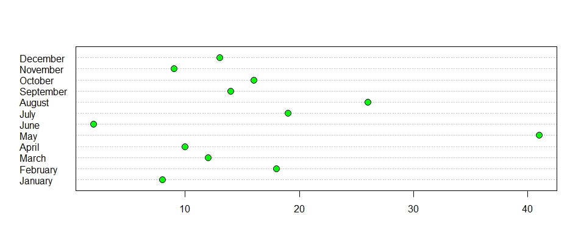
    </div>
    <div style="margin-right: 10px;">
      <figcaption style="text-align: center;">(2)</figcaption>
      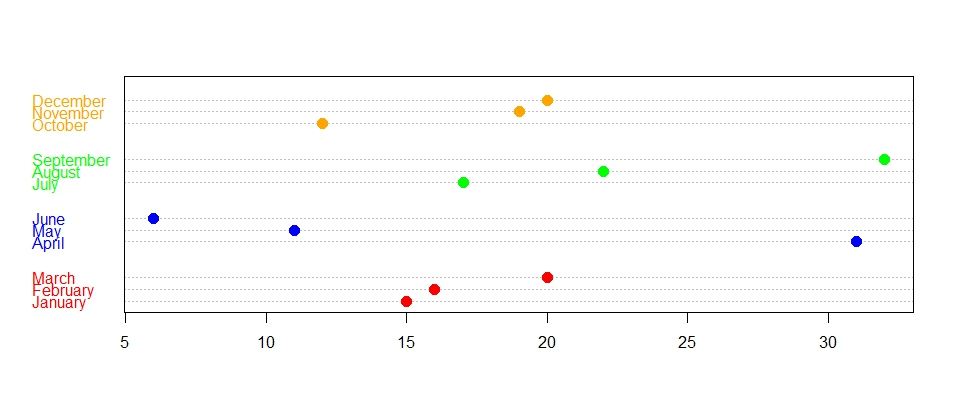
    </div>
    <div>
      <figcaption style="text-align: center;">(3)</figcaption>
      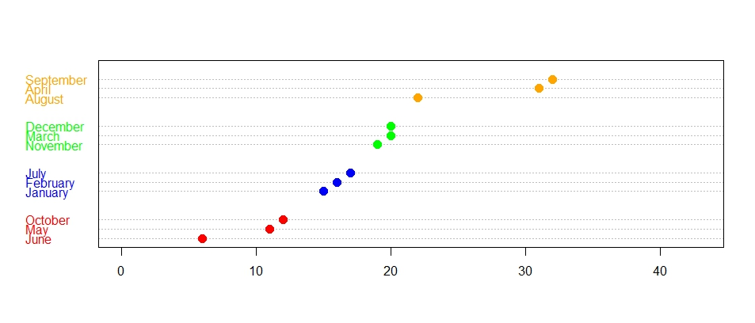
    </div>
</div>

## Preparación de los datos
```r
Ventas <- 
  base::data.frame(
    mes = month.name, 
    esperado = c(15, 16, 20, 31, 11, 6, 17, 22, 32, 12, 19, 20), 
    vendido = c(8, 18, 12, 10, 41, 2, 19, 26, 14, 16, 9, 13), 
    trimestre = c(
      base::rep(1, 3), 
      base::rep(2, 3), 
      base::rep(3, 3), 
      base::rep(4, 3)))

colores <- numeric(4)

colores[Ventas$trimestre == "1"] <- "red"
colores[Ventas$trimestre == "2"] <- "blue"
colores[Ventas$trimestre == "3"] <- "green"
colores[Ventas$trimestre == "4"] <- "orange"
```

## Gráficos

```r
# (1)
graphics::dotchart(
  x = Ventas$vendido, 
  labels = Ventas$mes, 
  pch = 21, 
  bg = "green", 
  pt.cex = 1.5)

# (2)
graphics::dotchart(
  x = Ventas$esperado, 
  labels = Ventas$mes, 
  pch = 19,
  pt.cex = 1.5, 
  groups = base::rev(Ventas$trimestre), 
  color = colores)

# (3)
graphics::dotchart(
  x = x$esperado, 
  labels = x$mes, 
  pch = 19,
  xlim = base::range(x$esperado, x$vendido) + c(-2, 2),
  pt.cex = 1.5, 
  color = colores, 
  groups = base::rev(Ventas$trimestre))
```

# Gráficos Dembbell

<div style="display: flex; flex-wrap: wrap;">
    <div style="margin-right: 10px; flex: 1;">
        <div style="margin-bottom: 10px;">
            <figcaption style="text-align: center;">(1)</figcaption>
            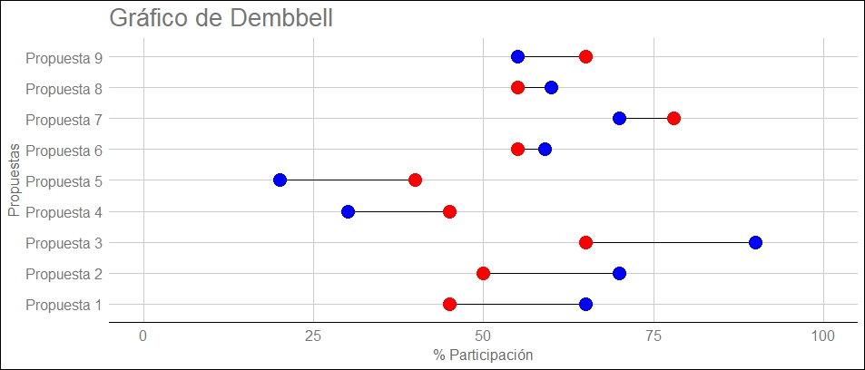
        </div>
        <div>
            <figcaption style="text-align: center;">(2)</figcaption>
            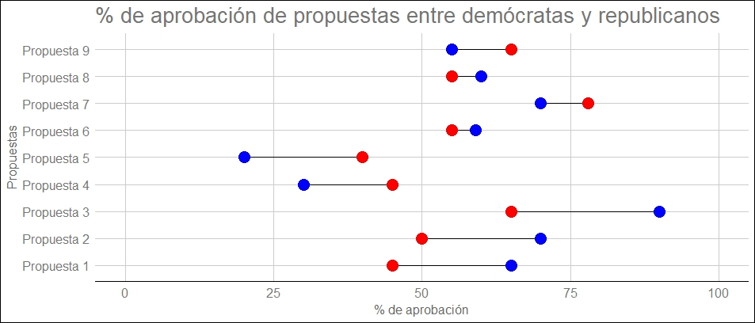
        </div>
    </div>
    <div style="margin-right: 10px; flex: 1;">
        <div style="margin-bottom: 10px;">
            <figcaption style="text-align: center;">(3)</figcaption>
            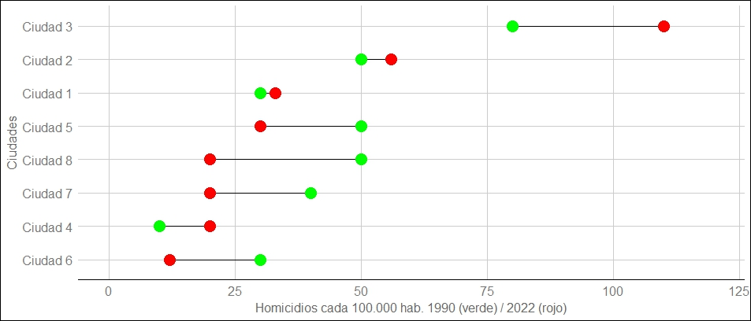
        </div>
        <div>
            <figcaption style="text-align: center;">(4)</figcaption>
            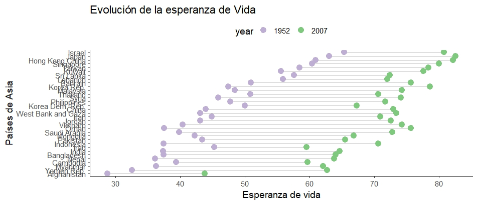
        </div>
    </div>
</div>

## Preparación de los datos

```r
data_Politica <- 
  base::data.frame(
    stringsAsFactors = TRUE,
    Propuestas = c(
      "Propuesta 1","Propuesta 2", "Propuesta 3","Propuesta 4","Propuesta 5",
      "Propuesta 6","Propuesta 7","Propuesta 8","Propuesta 9"),
    Republicanos = c(45L, 50L, 65L, 45L, 40L, 55L, 78L, 55L, 65L),
    Democratas = c(65L, 70L, 90L, 30L, 20L, 59L, 70L, 60L, 55L))

TasaHomicidios <-
  base::data.frame(
    stringsAsFactors = TRUE,
    check.names = FALSE,
    Ciudades = c(
      "Ciudad 1","Ciudad 2","Ciudad 3","Ciudad 4",
      "Ciudad 5","Ciudad 6","Ciudad 7","Ciudad 8"),
    `1990` = c(30, 50, 80, 10, 50, 30, 40, 50),
    `2022` = c(33, 56, 110, 20, 30, 12, 20, 20))

EsperanzaVida <- 
  utils::read.csv(
    file = "data/EsperanzaVida.csv",
    sep = ';',
    header = TRUE)

EsperanzaVida <- 
  EsperanzaVida |> 
  dplyr::filter(year %in% c(1952,2007)) |> 
  dplyr::filter(continent == "Asia") |> 
  dplyr::mutate(
    paired = base::rep(1:(dplyr::n()/2), each = 2),
    year = base::factor(year))
```

## Gráficos
```r
# (1): `ggplot2`
data_Politica |> 
  ggplot2::ggplot() +
  ggplot2::geom_segment(
    mapping = ggplot2::aes(
      x = Democratas, 
      xend = Republicanos,
      y = Propuestas, 
      yend = Propuestas)) +
  ggplot2::geom_point(
    mapping = ggplot2::aes(
      x = Democratas, 
      y = Propuestas), 
    size = 5,
    color="blue") +
  ggplot2::labs(title = "Gráfico de Dembbell") +
  ggplot2::xlab("% Participación") +
  ggplot2::geom_point(
    mapping = ggplot2::aes(
      x = Republicanos, 
      y = Propuestas), 
    size = 5,
    color = "red") +
  ggplot2::xlim(0, 100)

# (2): `ggalt`
ggplot2::ggplot(
  data = data_Politica, 
  mapping = ggplot2::aes(
    y = Propuestas,
    x = Democratas,
    xend = Republicanos)) + 
  ggalt::geom_dumbbell(
    size_x = 5,
    size_xend = 5,
    color = "black",
    colour_x = "blue",
    colour_xend = "red") +
  ggplot2::labs(
    title = "% de aprobación de propuestas entre demócratas y republicanos",
    x = "% de aprobación") +
  ggplot2::xlim(0, 100)

# (3)
TasaHomicidios |> 
  dplyr::mutate(
    Ciudades = forcats::fct_reorder(Ciudades, `2022`)) |> 
  ggplot2::ggplot(
    mapping = ggplot2::aes(
      y = Ciudades,
      x = `1990`,
      xend = `2022`)) + 
  ggalt::geom_dumbbell(
    size_x = 5,
    size_xend = 5,
    color = "black",
    colour_x = "green",
    colour_xend = "red",) +
  ggplot2::labs(
    x = "Homicidios cada 100.000 hab. 1990 (verde) / 2022 (rojo)") +
  ggplot2::xlim(0, 120)

# (4)
EsperanzaVida |> 
  ggplot2::ggplot(
    mapping = ggplot2::aes(
      x = lifeExp, 
      y = stats::reorder(country, lifeExp))) +
  ggplot2::geom_line(
    mapping = ggplot2::aes(group = paired),
    color = "grey") +
  ggplot2::geom_point(
    mapping = ggplot2::aes(color = year), size = 4) +
  ggplot2::labs(y = "Países de Asia") +
  ggplot2::theme_classic(14) +
  ggplot2::theme(legend.position = "top") +
  ggplot2::labs(title = "Evolución de la esperanza de Vida") +
  ggplot2::xlab("Esperanza de vida") +
  ggplot2::scale_color_brewer(
    palette = "Accent", 
    direction = -1)
```

# Gráfico de líneas

## Opción 1

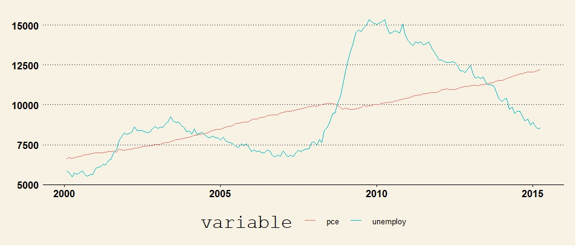

```r
# Datos
Empleados <- 
  utils::read.csv(
    file = "data/empleados.csv",
    encoding = "latin1",
    sep = ";")

# Gráfico
Empleados |>  
  dplyr::group_by(educacion, Sexo) |>  
  dplyr::summarise(Prom = base::mean(Sueldo_actual)) |> 
  ggplot2::ggplot(
    mapping = ggplot2::aes(
      x = educacion,
      y = Prom,
      color = Sexo)) +
  ggplot2::geom_line(lwd = 1.1) +
  ggplot2::geom_point(size = 3) +
  ggplot2::facet_wrap(
    ~ "Evolución del sueldo promedio de acuerdo a lo años de estudio según género")
```

## Opción 2

<div style="display: flex;">
    <div style="margin-right: 10px;">
        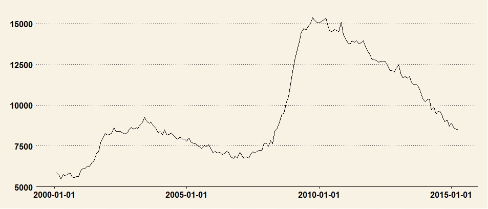
    </div>
    <div>
        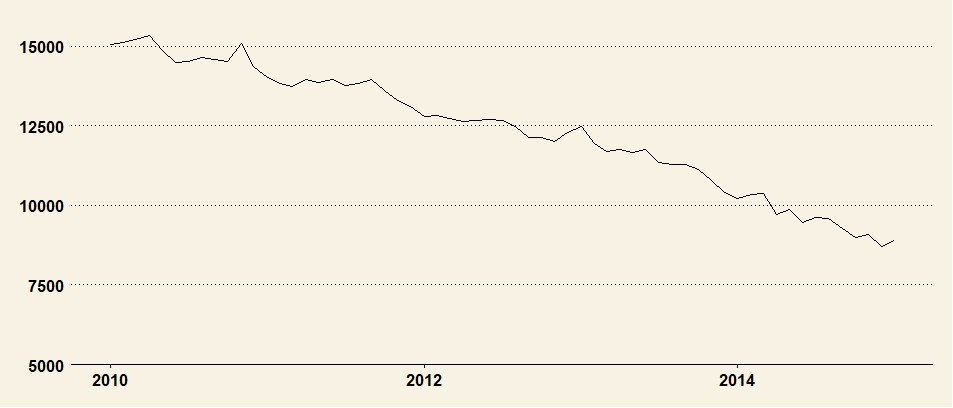
    </div>
</div>

```r
# Datos
Empleados <- 
  utils::read.csv(
    file = "data/empleados.csv",
    encoding = "latin1",
    sep = ";")

# Gráfico
Empleados |> 
  dplyr::mutate(
    anios_estudios = dplyr::case_when(
      educacion == 12 ~ "2",
      educacion > 12 & educacion <= 14 ~ "3",
      educacion > 14 & educacion <= 18 ~ "4",
      educacion > 18 ~ "5",
      TRUE ~ "1")) |> 
  dplyr::group_by(experiencia, anios_estudios) |>  
  dplyr::summarise(Prom = base::mean(Sueldo_actual)) |> 
  ggplot2::ggplot(
    data = ResumenAniosEst,
    mapping = ggplot2::aes(
      x = experiencia,
      y = Prom,
      color = anios_estudios)) +
  ggplot2::geom_line(lwd = 0.9) +
  ggplot2::geom_point(size = 2) +
  ggplot2::scale_color_manual(
    values = c("#D43F3A", "#EEA236", "#5CB85C", "#46B8DA", "#9632B8"),
    labels = c("Basica", "Media", "Técnica", "Universitaria", "Postgrado")) +
  ggplot2::facet_wrap(
    ~ "Evolución del sueldo promedio de acuerdo a la experiencia segun segun nivel de estudio")
```

## Opción 3

<div style="display: flex;">
    <div style="margin-right: 10px;">
        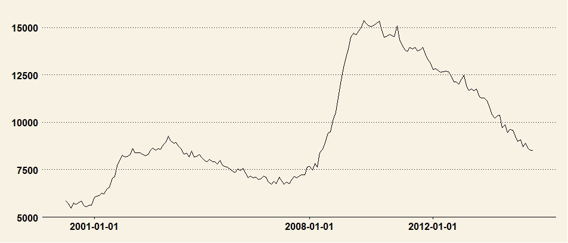
    </div>
    <div style="margin-right: 10px;">
        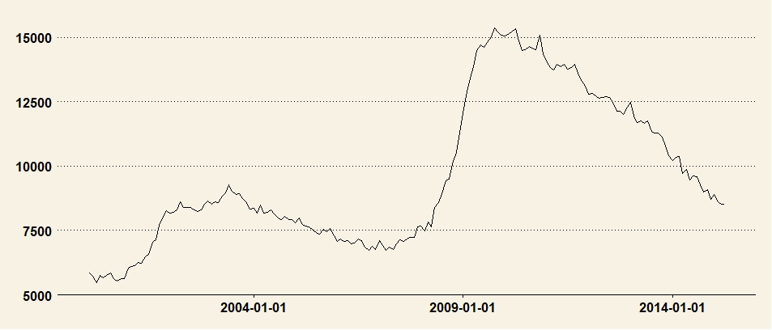
    </div>
    <div>
        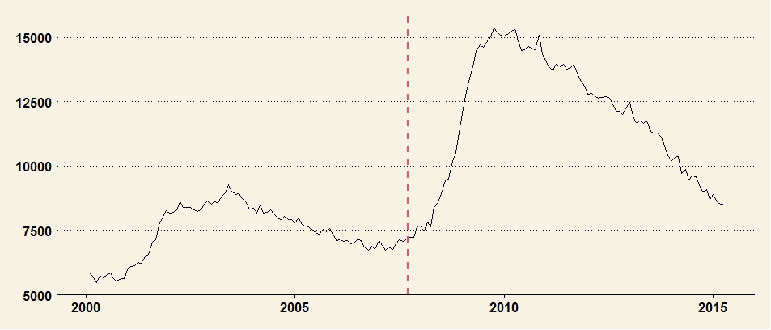
    </div>
</div>

```r
# Datos
Empleados <- 
  utils::read.csv(
    file = "data/empleados.csv",
    encoding = "latin1",
    sep = ";")

# Gráfico
Empleados |> 
  dplyr::mutate(
    anios_estudios = dplyr::case_when(
      educacion == 12 ~ "2",
      educacion > 12 & educacion <= 14 ~ "3",
      educacion > 14 & educacion <= 18 ~ "4",
      educacion > 18 ~ "5",
      TRUE ~ "1")) |> 
  dplyr::group_by(experiencia, anios_estudios) |>  
  dplyr::summarise(Prom = base::mean(Sueldo_actual)) |> 
  ggplot2::ggplot(
    data = ResumenAniosEst, 
    mapping = ggplot2::aes(
      x = experiencia, 
      y = Prom, 
      group = anios_estudios)) + 
  ggplot2::geom_line(
    mapping = ggplot2::aes(color = anios_estudios),
    lwd = 0.9) + 
  ggplot2::scale_color_discrete(
    labels = c("Basica","Media","Técnica","Universitaria","Postgrado")) +
  ggplot2::facet_wrap(~ anios_estudios) +
  ggplot2::theme_light()
```

# Gráfico de serie temporal

## Opción 4

<div style="display: flex;">
    <div style="margin-right: 10px;">
        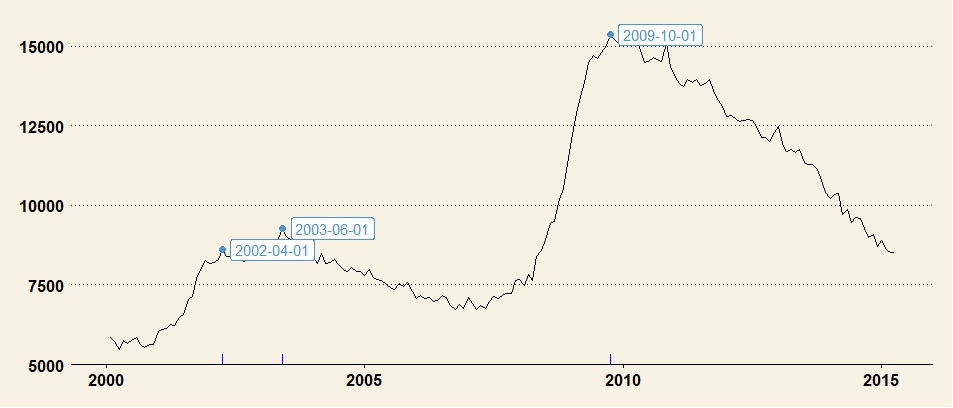
    </div>
    <div>
        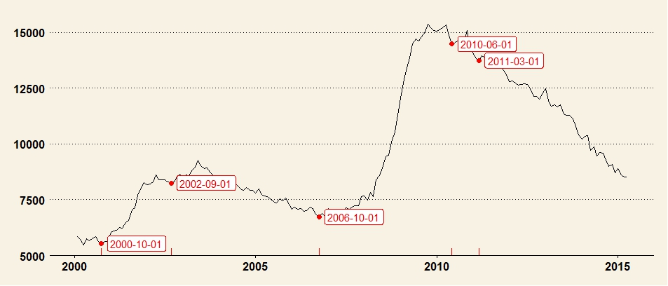
    </div>
</div>

```r
# Datos
economics <- ggplot2::economics

df <- 
  economics |> 
  dplyr::filter(date > base::as.Date("2000-01-01"))

# Gráfico
ggplot2::ggplot(
  data = df, 
  mapping = ggplot2::aes(x = date, y = unemploy)) +
  ggplot2::geom_line() +
  ggpmisc::stat_peaks(
    geom = "point", 
    span = 15, 
    color = "steelblue3", 
    size = 2) +
  ggpmisc::stat_peaks(
    geom = "label", 
    span = 15, 
    color = "steelblue3", 
    angle = 0,
    hjust = -0.1, 
    x.label.fmt = "%Y-%m-%d") +
  ggpmisc::stat_peaks(
    geom = "rug", 
    span = 15, 
    color = "blue", 
    sides = "b")

ggplot2::ggplot(
  data = df, 
  mapping = ggplot2::aes(x = date, y = unemploy)) +
  ggplot2::geom_line() +
  ggpmisc::stat_valleys(
    geom = "point", 
    span = 11, 
    color = "red", 
    size = 2) +
  ggpmisc::stat_valleys(
    geom = "label", 
    span = 11, 
    color = "red", 
    angle = 0,
    hjust = -0.1, 
    x.label.fmt = "%Y-%m-%d") +
  ggpmisc::stat_valleys(
    geom = "rug", 
    span = 11, 
    color = "red", 
    sides = "b")
```

## Opción 5

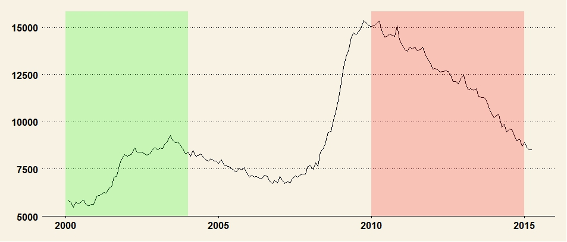

```r
# Datos
economics <- ggplot2::economics

df <- 
  economics |> 
  dplyr::filter(date > base::as.Date("2000-01-01"))

# Gráfico
shade <- base::data.frame(
  x1 = c(as.Date("2000-01-01"), as.Date("2010-01-01")),
  x2 = c(as.Date("2004-01-01"), as.Date("2015-01-01")),
  min = c(-Inf, -Inf), max = c(Inf, Inf))

ggplot2::ggplot() +
  ggplot2::geom_line(
    data = df, 
    mapping = ggplot2::aes(x = date, y = unemploy)) +
  ggplot2::geom_rect(
    data = shade, 
    mapping = ggplot2::aes(
      xmin = x1, 
      xmax = x2, 
      ymin = min, 
      ymax = max),
    fill = c("green", "red"), 
    alpha = 0.2)
```

# Gráfico de pendientes

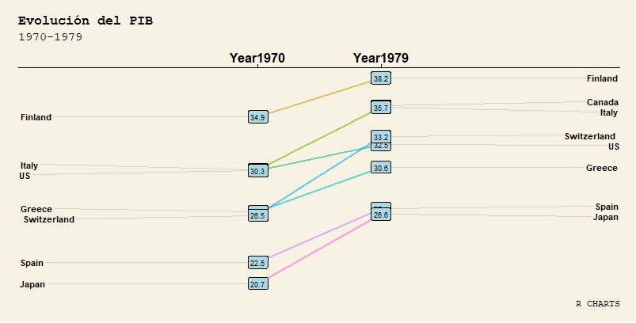

```r
# Datos
PBI <- CGPfunctions::newgdp[16:30, ]

# Gráfico
CGPfunctions::newggslopegraph(
  dataframe = PBI, 
  Times = Year, 
  Measurement = GDP, 
  Grouping = Country,
  Title = "Evolución del PIB",
  SubTitle = "1970-1979",
  Caption = "R CHARTS",
  ThemeChoice = "wsj",
  DataLabelPadding = 0.2,
  DataLabelLineSize = 0.5,
  DataLabelFillColor = "lightblue")
```

# Gráfico de series

## Gráfico de barras

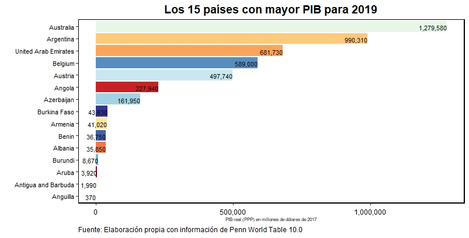

```r
# Datos
ppp.DF <- base::data.frame(
  country = pwt10::pwt10.0$country, 
  isocode = pwt10::pwt10.0$isocode,
  year = pwt10::pwt10.0$year, 
  gdp = pwt10::pwt10.0$rgdpe,
  pc.GDP = (pwt10::pwt10.0$rgdpe / pwt10::pwt10.0$pop) / 1000.0)

pib2019 <- 
  ppp.DF |> 
  dplyr::filter(year == 2019) |> 
  dplyr::select(country, year, gdp, pc.GDP)

# colourCount = base::length(base::unique(pib2019$country))
colourCount = 15
getPalette = grDevices::colorRampPalette(RColorBrewer::brewer.pal(15, "RdYlBu"))

# Gráfico
pib2019 |> 
  dplyr::slice_head(n = 15) |> 
  ggplot2::ggplot(
    mapping = ggplot2::aes(
      x = stats::reorder(country, gdp, sum), 
      y = gdp, 
      fill = country)) +
  ggplot2::geom_bar(stat = 'identity') +
  ggplot2::coord_flip() +
  ggplot2::labs(
    title = "Los 15 países con mayor PIB para 2019",
    x = "",
    y = "PIB real (PPP) en millones de dólares de 2017",
    caption = "Fuente: Elaboración propia con información de Penn World Table 10.0") +
  ggplot2::theme(
    plot.caption = ggplot2::element_text(hjust = 0, size = 9),
    plot.title = ggplot2::element_text(hjust = 0.5, size = 14, face = "bold"),
    legend.position = "none",
    panel.background = ggplot2::element_blank(),
    panel.border = ggplot2::element_rect(
      colour = "black", 
      fill = NA, 
      linewidth = 1),
    axis.title.x = ggplot2::element_text(size = 6),
    axis.text.x = ggplot2::element_text(
      angle = 0,
      vjust = 0.2,
      hjust = 0.5, 
      colour = "black"),
    axis.text.y = ggplot2::element_text(
      hjust = 1,
      colour = "black",
      size = 8)) + 
  ggplot2::scale_y_continuous(label = scales::comma) +
  ggplot2::scale_fill_manual(values = getPalette(colourCount)) +
  ggplot2::geom_text(
    mapping = ggplot2::aes(label = scales::comma(base::round(gdp,-1))),
    size = 3, 
    hjust = 1, 
    nudge_x = -0.5, 
    vjust = -0.5)
```

## Gráfico de líneas

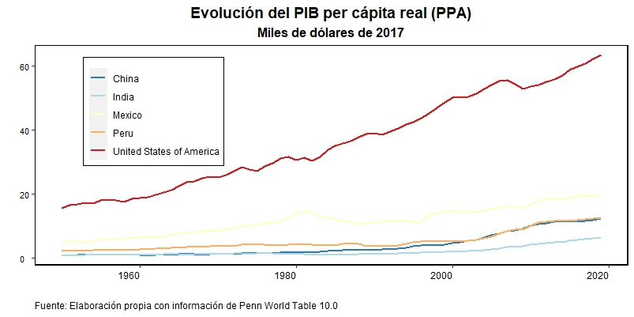

```r
# Datos
ppp.DF <- base::data.frame(
  country = pwt10::pwt10.0$country, 
  isocode = pwt10::pwt10.0$isocode,
  year = pwt10::pwt10.0$year, 
  gdp = pwt10::pwt10.0$rgdpe,
  pc.GDP = (pwt10::pwt10.0$rgdpe / pwt10::pwt10.0$pop) / 1000.0)

PIBpc <- 
  ppp.DF |>
  dplyr::mutate(
    Diff_year = year - dplyr::lag(year),
    Diff_growth = pc.GDP - dplyr::lag(pc.GDP),
    Rate_percent = (Diff_growth / Diff_year)/pc.GDP * 100) |> 
  dplyr::filter(isocode %in% c("CHN", "USA", "MEX", "IND", "PER"))

# Gráfico
PIBpc |> 
  ggplot2::ggplot(mapping = ggplot2::aes(x = year, y = pc.GDP, color = country)) + 
  ggplot2::geom_line(size = 1, na.rm = T) +
  ggplot2::scale_color_brewer(
    name = " ",
    palette = "RdYlBu",
    direction = -1) +
  ggplot2::theme(
    plot.caption = ggplot2::element_text(hjust = 0, size = 9),
    plot.title = ggplot2::element_text(hjust = 0.5, size = 14, face = "bold"),
    plot.subtitle = ggplot2::element_text(hjust = 0.5, size = 12, face = "bold"),
    axis.text.x = ggplot2::element_text(
      angle = 0, vjust = 1, hjust = 1, colour = "black"),
    legend.position = c(0.2, 0.7),
    legend.title = ggplot2::element_blank(),
    legend.background = ggplot2::element_rect(fill = NA, colour = 1),
    panel.background = ggplot2::element_blank(),
    panel.border = ggplot2::element_rect(
      colour = "black", 
      fill = NA, 
      size = 1),
    axis.text.y = ggplot2::element_text(hjust = 0, colour = "black", size = 8))+
  ggplot2::labs(
    title = "Evolución del PIB per cápita real (PPA)",
    subtitle = "Miles de dólares de 2017",
    caption = "Fuente: Elaboración propia con información de Penn World Table 10.0") +
  ggplot2::xlab("") +
  ggplot2::ylab("")+
  ggplot2::scale_y_continuous(label = scales::comma)
```

## Gráfico de variación

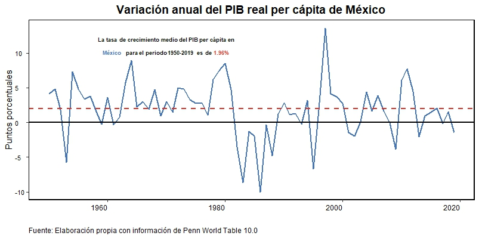

```r
# Datos
TDCP <- 
  PIBpc |> 
  dplyr::filter(isocode == "MEX") |> 
  {\(x) 
    (
      (x$pc.GDP[x$year == 2019] / x$pc.GDP[x$year == 1950])**(1/base::nrow(x)) - 1
    ) *100
  }()

texto.PIBpc <- 
  base::paste0(
    'La tasa de crecimiento medio del PIB per cápita en',
    '<br><br>',
    '<span style="color:#4575b4;">',
    '**México** ',
    '</span>',
    'para el periodo 1950-2019 es de ', 
    '<span style="color:#d73027;">',
    '**1.96%**',
    '</span>')

# Gráfico
PIBpc |> 
  dplyr::filter(isocode == "MEX") |> 
  ggplot2::ggplot(mapping = ggplot2::aes(x = year, y = Rate_percent)) +
  ggplot2::geom_line(cex = 0.8, col = "#4575b4") +
  ggplot2::geom_hline(yintercept = 0, size = 0.8, col = "black") +
  ggplot2::theme(
    plot.caption = ggplot2::element_text(hjust = 0, size = 9),
    plot.title = ggplot2::element_text(hjust = 0.5, size = 14, face = "bold"),
    plot.subtitle = ggplot2::element_text(hjust = 0.5, size = 12,face = "bold"),
    legend.position = "none",
    legend.title = ggplot2::element_blank(),
    panel.background = ggplot2::element_blank(),
    panel.border = ggplot2::element_rect(colour = "black", fill = NA, size = 1),
    axis.text.x = ggplot2::element_text(
      angle = 0, vjust = 1, hjust = 1, colour = "black"),
    axis.text.y = ggplot2::element_text(
      hjust = 0, colour = "black", size = 8)) +
  ggplot2::labs(
    title = "Variación anual del PIB real per cápita de México",
    caption = "Fuente: Elaboración propia con información de Penn World Table 10.0") +
  ggplot2::xlab("") +
  ggplot2::ylab("Puntos porcentuales") +
  ggplot2::geom_hline(
    yintercept = 1.96, 
    size = 0.8, 
    col = "#d73027",
    linetype = 'dashed') +
  ggplot2::annotate(
    geom = ggtext::GeomRichtext,
    x = 1970, 
    y = 11,
    label = texto.PIBpc,
    label.colour = NA, 
    fill = NA,
    fontface = "bold",
    color = "black",
    size = 2.5)
```

# Gráfico de Lollipop

## Opción 1

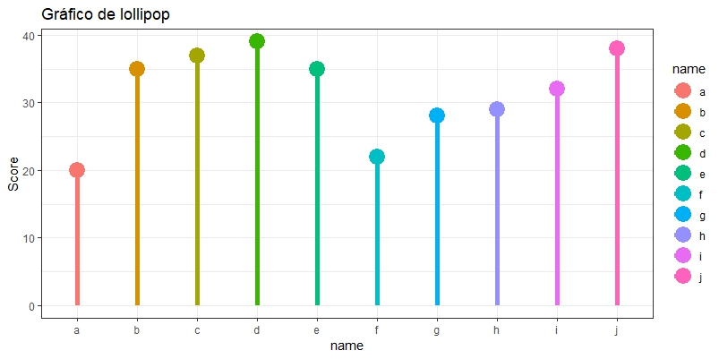

```r
# Datos
name <- base::letters[1:10]
score <- c(20,35,37,39,35,22,28,29,32,38)
df <- base::data.frame(name, score)

# Gráfico
df |> 
  ggplot2::ggplot(mapping = ggplot2::aes(x = name, y = score, color = name)) +
  ggplot2::geom_point(size = 6) +
  ggplot2::geom_segment(
    mapping = ggplot2::aes(x = name, xend = name, y = 0, yend = score), 
    size = 2) +
  ggplot2::theme_bw() + 
  ggplot2::labs(
    title = "Gráfico de lollipop",
    X = "Nombre del estudiante",
    y = "Score")
```

## Opción 2

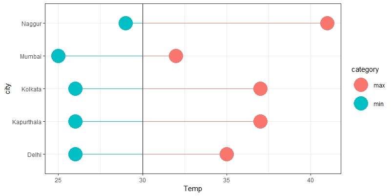

```r
# Datos
city <- c("Delhi", "Mumbai", "Kolkata", "Naggur", "Kapurthala")
max <- c(35,32,37,41,37)
min <- c(26,25,26,29,26)
lp2 <- base::data.frame(city, max, min)
lp2 <- tidyr::gather(lp2, key = "category", value = "Temp", 2:3)

# Gráfico
ggplot2::ggplot(
  data = lp2,
  mapping = ggplot2::aes(
    x = city,
    y = Temp,
    color = category)) +
  ggplot2::geom_point(size = 10) +
  ggplot2::geom_segment(
    mapping = ggplot2::aes(
      x = city,
      xend = city, 
      y = 30,
      yend = Temp)) +
  ggplot2::theme_bw() +
  ggplot2::coord_flip() +
  ggplot2::geom_hline(mapping = ggplot2::aes(yintercept = 30))
```

## Opción 3

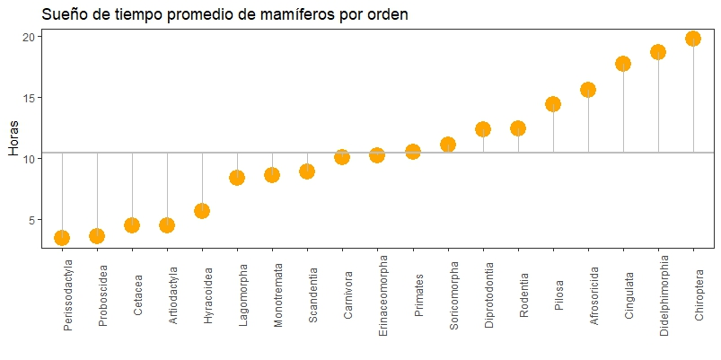

```r
# Datos
msleep <- ggplot2::msleep

# Gráfico
msleep |> 
  dplyr::group_by(order) |>
  dplyr::summarise(mean_sleep = base::mean(sleep_total)) |> 
  dplyr::mutate(order = forcats::fct_reorder(order, mean_sleep)) |> 
  ggplot2::ggplot(mapping = ggplot2::aes(x = order, y = mean_sleep)) +
  ggplot2::geom_point(
    size = 6,
    colour = "orange") +
  ggplot2::geom_segment(
    mapping = ggplot2::aes(
      x = order,
      y = base::mean(msleep$sleep_total),
      xend = order,
      yend = mean_sleep),
    colour = "grey") +
  ggplot2::geom_hline(
    yintercept = base::mean(msleep$sleep_total),
    colour = "grey",
    size = 1) +
  ggplot2::theme_bw() +
  ggplot2::theme(
    panel.grid = ggplot2::element_blank(),
    axis.text.x = ggplot2::element_text(angle = 90)) +
  ggplot2::labs(
    title="Sueño de tiempo promedio de mamíferos por orden",
    x="",
    y="Horas")
```

# Gráficos financieros

## Gráfico de líneas

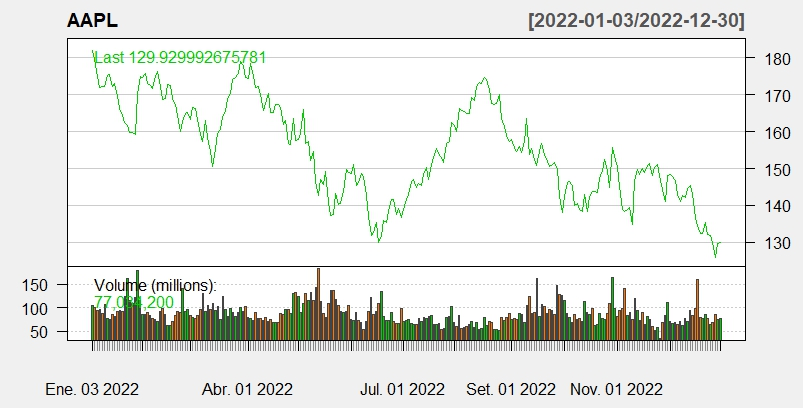

```r
# Datos
quantmod::getSymbols(Symbols = "AAPL", src="yahoo", from="2021-01-02")

# Gráfico
quantmod::chartSeries(
  x = `AAPL`, 
  type = "line",
  subset = '2022',
  theme = quantmod::chartTheme('white'))
```

## Gráfico de barras

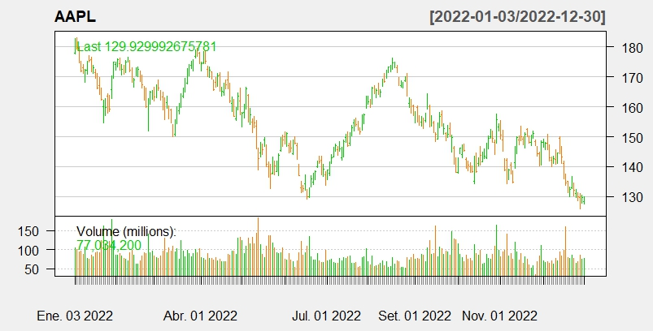

```r
# Datos
quantmod::getSymbols(Symbols = "AAPL", src="yahoo", from="2021-01-02")

# Gráfico
quantmod::chartSeries(
  x = `AAPL`,
  type = "bar",
  subset = '2022',
  theme = quantmod::chartTheme('white'))
```

## Gráfico de velas

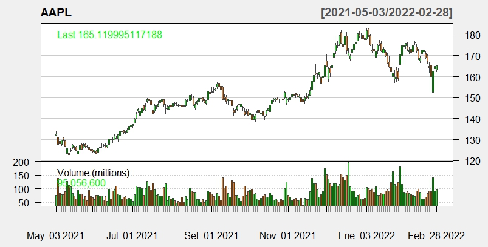

```r
# Datos
quantmod::getSymbols(Symbols = "AAPL", src="yahoo", from="2021-01-02")

# Gráfico
quantmod::chartSeries(
  x = `AAPL`,
  subset = '2021-05::2022-02',
  up.col = 'green',
  down.col = 'black',
  theme = quantmod::chartTheme('white'))
```

## Incluir: Media Movil

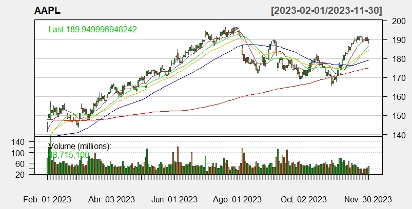

```r
# Datos
quantmod::getSymbols(Symbols = "AAPL", src="yahoo", from="2021-01-02")

# Gráfico
quantmod::chartSeries(
  x = `AAPL`,
  subset = "last 10 months",
  theme = quantmod::chartTheme('white'))

quantmod::addSMA()
quantmod::addSMA(n = 20, on = 1, col = "green")
quantmod::addSMA(n = 50, on = 1, col = "blue")
quantmod::addSMA(n = 200, on = 1, col = "red")
quantmod::addEMA(n = 30, on = 1, col = "orange")
```

## Incluir: Bandas de Bollinger

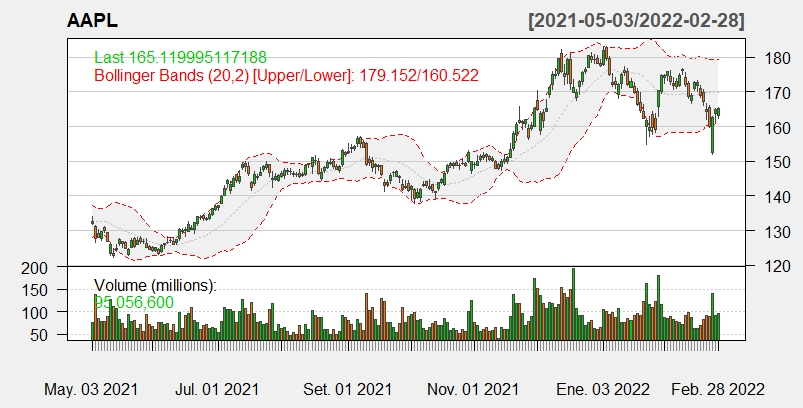

```r
# Datos
quantmod::getSymbols(Symbols = "AAPL", src="yahoo", from="2021-01-02")

# Gráfico
quantmod::chartSeries(
  x = `AAPL`,
  subset = '2021-05::2022-02',
  theme = quantmod::chartTheme('white'))

quantmod::addBBands(n = 20, sd = 2)
```

## Incluir: Momentos

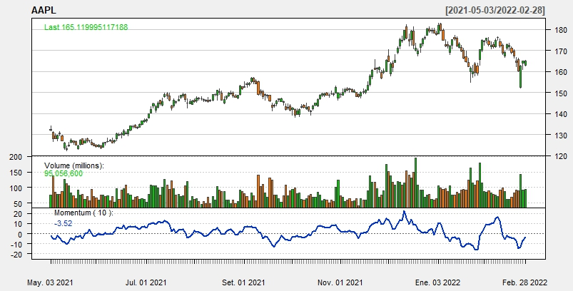

```r
# Datos
quantmod::getSymbols(Symbols = "AAPL", src="yahoo", from="2021-01-02")

# Gráfico
quantmod::chartSeries(
  x = `AAPL`,
  subset = '2021-05::2022-02',
  theme = quantmod::chartTheme('white'))

quantmod::addMomentum(n = 10)
```


# Gráfico de pirámide población

## Usando: `pyramid`


```r
# Datos
Edad <- c(
  "0 a 4","5 a 9","10 a 14","15 a 19","20 a 24","25 a 29","30 a 34","35 a 39",
  "40 a 44","45 a 49","50 a 54","55 a 59","60 a 64","65 a 69","70 a 74",
  "75 a 79","80 a 84","85 y más")

Hombres <- c(
  1555605,1705574,1848218,1970530,1983553,1835158,1649783,1560417,1308328,
  1245829,1213908,1057242,840134,639772,457772,325224,205428,168018)

Mujeres <- c(
  1482176,1629666,1762366,1881725,1956735,1857016,1700746,1656227,1436336,
  1400272,1382470,1223557,984516,750320,546647,405409,281348,256392)

datos <- base::data.frame(
  H1 = base::round(Hombres/1000, 0),
  M1 = base::round(Mujeres/1000, 0))

# Gráfico
pyramid::pyramid(
  data = datos,
  Llab = "Hombres",
  Rlab = "Mujeres",
  Clab = "Edad",
  main = "Población de Colombia 2018 \n (en miles)",
  Lcol = "green", 
  Rcol = "cyan", 
  Cgap = 0.5)
```

## Usando: `apyramid` y `ggplot2`

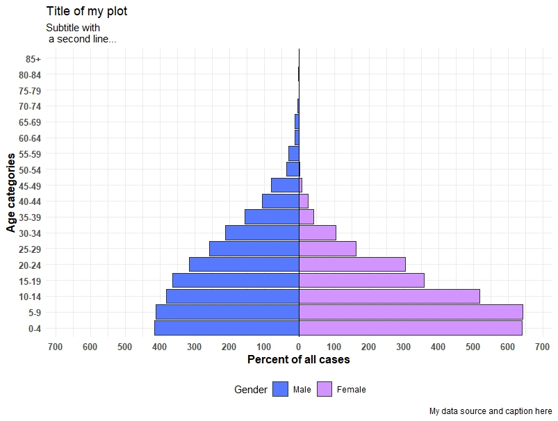

```r
# Datos
linelist <- base::readRDS(
  file = "data/linelist_cleaned.rds"
)

# Gráfico
apyramid::age_pyramid(
  data = linelist,
  age_group = "age_cat5",
  split_by = "gender",
  show_midpoint = FALSE, # TRUE: Para mostrar los medios en cada intervalo
  proportional = FALSE # TRUE: Para mostrar porcentajes
) +
  ggplot2::theme_minimal() +
  ggplot2::scale_fill_manual(
    values = c("#5679FD", "#D294FE"),
    labels = c("m" = "Male", "f" = "Female")) +
  ggplot2::labs(
    y = "Percent of all cases",
    x = "Age categories",
    fill = "Gender",
    caption = "My data source and caption here",
    title = "Title of my plot",
    subtitle = "Subtitle with \n a second line...") +
  ggplot2::theme(
    legend.position = "bottom",
    axis.text = ggplot2::element_text(size = 10, face = "bold"),
    axis.title = ggplot2::element_text(size = 12, face = "bold"))
```

## Usando: `ggplot2` - Opción 1

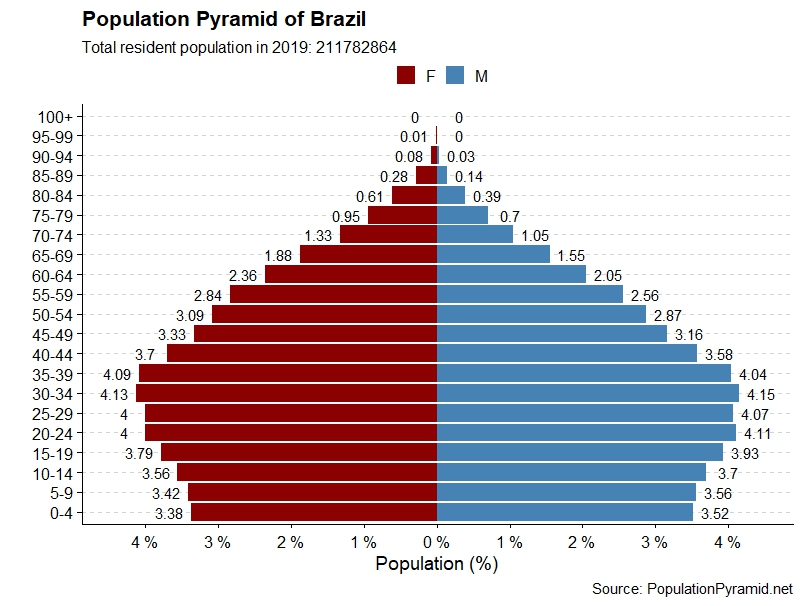

```r
# Datos
url <- 'https://www.populationpyramid.net/api/pp/76/2019/?csv=true'
data <- utils::read.csv(url)

data <- 
  data |> 
  tidyr::pivot_longer(
    names_to = 'Gender', 
    values_to = 'Population', 
    cols = 2:3) |> 
  dplyr::mutate(
    PopPerc = dplyr::case_when(
      Gender == 'M' ~ base::round(Population/base::sum(Population)*100,2),
      TRUE ~ - base::round(Population/base::sum(Population)*100,2)),
    signal = dplyr::case_when(
      Gender == 'M' ~ 1,
      TRUE ~ -1),
    Age = base::factor(Age, levels = base::unique(Age), ordered = TRUE))

# Gráfico
data |> 
ggplot2::ggplot() +
  ggplot2::geom_bar(
    mapping = ggplot2::aes(x = Age, y = PopPerc, fill = Gender), stat = 'identity') +
  ggplot2::geom_text(
    mapping = ggplot2::aes(
      x = Age, 
      y = PopPerc + signal * .3, 
      label = base::abs(PopPerc))) +
  ggplot2::coord_flip() +
  ggplot2::scale_fill_manual(name = '', values = c('darkred', 'steelblue')) +
  ggplot2::scale_y_continuous(
    breaks = base::seq(-10,10,1),
    labels = function(x){base::paste(base::abs(x), '%')}) +
  ggplot2::labs(
    x = '',
    y = 'Population (%)',
    title = 'Population Pyramid of Brazil',
    subtitle = base::paste(
      'Total resident population in 2019:', 
      base::format(base::sum(data$Population), decimal.mark = '.')),
    caption = 'Source: PopulationPyramid.net') +
  cowplot::theme_cowplot() +
  ggplot2::theme(
    axis.text.x = ggplot2::element_text(vjust = .5),
    panel.grid.major.y = ggplot2::element_line(
      color = 'lightgray', 
      linetype = 'dashed'),
    legend.position = 'top',
    legend.justification = 'center')
```

## Usando: `ggplot2` - Opción 2

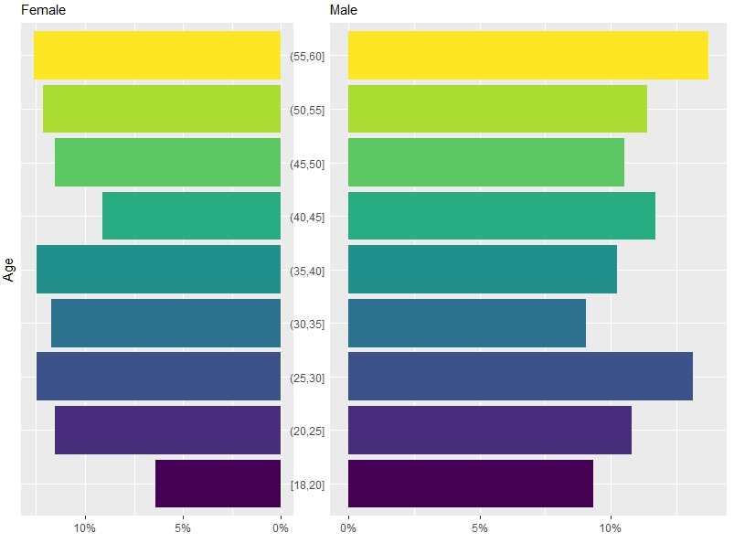

```r
# Datos
df <- base::data.frame(
  Type = base::sample(c('Male', 'Female', 'Female'), 1000, replace=TRUE),
  Age = sample(18:60, 1000, replace=TRUE))

AgesFactor <- base::ordered(
  base::cut(
    df$Age, breaks = c(18, base::seq(20,60,5)),
    include.lowest = TRUE))

df$Age <- AgesFactor

# Gráfico
gg <- ggplot2::ggplot(data = df, mapping = ggplot2::aes(x = Age))

gg.male <- gg + 
  ggplot2::geom_bar(
    data = base::subset(df, Type == 'Male'),
    mapping = ggplot2::aes(
      y = ..count../base::sum(ggplot2::after_stat(count)), 
      fill = Age)) +
  ggplot2::scale_y_continuous(name = '', labels = scales::percent) + 
  ggplot2::theme(
    legend.position = 'none',
    axis.title.y = ggplot2::element_blank(),
    plot.title = ggplot2::element_text(size = 11.5),
    plot.margin = grid::unit(c(0.1,0.2,0.1,-.1), "cm"),
    axis.ticks.y = ggplot2::element_blank(), 
    axis.text.y = ggplot2::theme_bw()$axis.text.y) + 
  ggplot2::ggtitle("Male") + 
  ggplot2::coord_flip()    

gg.female <- gg + 
  ggplot2::geom_bar(
    data = base::subset(df, Type == 'Female'), 
    mapping = ggplot2::aes(
      y = ..count../base::sum(ggplot2::after_stat(count)), 
      fill = Age)) +
  ggplot2::scale_y_continuous(
    name = '', 
    labels = scales::percent, 
    trans = 'reverse') + 
  ggplot2::theme(
    legend.position = 'none',
    axis.text.y = ggplot2::element_blank(),
    axis.ticks.y = ggplot2::element_blank(), 
    plot.title = ggplot2::element_text(size = 11.5),
    plot.margin = grid::unit(c(0.1,0,0.1,0.05), "cm")) + 
  ggplot2::ggtitle("Female") + 
  ggplot2::coord_flip() + 
  ggplot2::ylab("Age")

gridExtra::grid.arrange(
  gg.female,
  gg.male,
  widths = c(0.4,0.6),
  ncol = 2
)
```