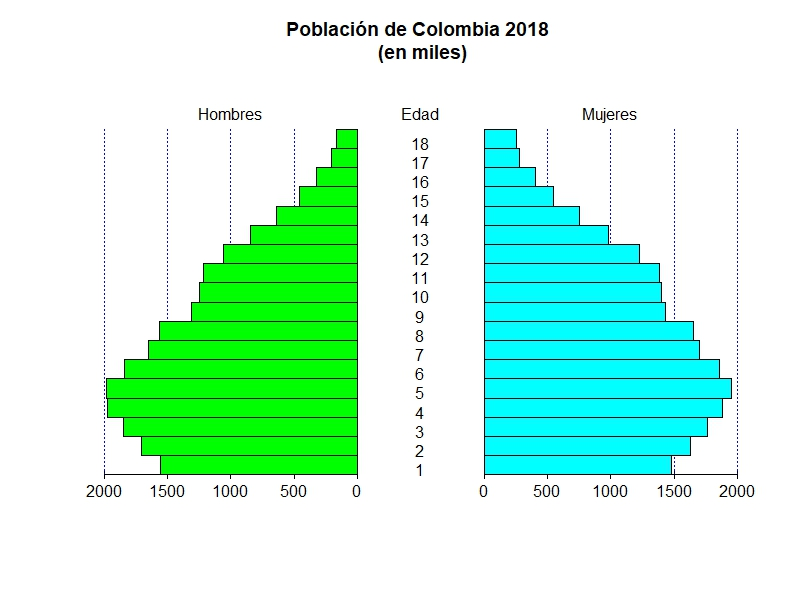

## Gráfico de pirámide población

<div style="text-align: center;">
  
</div>

```r
## Datos
Edad <- c(
  "0 a 4","5 a 9","10 a 14","15 a 19","20 a 24",
  "25 a 29","30 a 34","35 a 39","40 a 44","45 a 49",
  "50 a 54","55 a 59","60 a 64","65 a 69","70 a 74",
  "75 a 79","80 a 84","85 y más")

Hombres <- c(
  1555605,1705574,1848218,1970530,1983553,1835158,
  1649783,1560417,1308328,1245829,1213908,1057242,
  840134,639772,457772,325224,205428,168018)

Mujeres <- c(
  1482176,1629666,1762366,1881725,1956735,1857016,
  1700746,1656227,1436336,1400272,1382470,1223557,
  984516,750320,546647,405409,281348,256392)

datos <- base::data.frame(
  H1 = base::round(Hombres/1000, 0),
  M1 = base::round(Mujeres/1000, 0))

## Gráfico
pyramid::pyramid(
  data = datos,
  Llab = "Hombres",
  Rlab = "Mujeres",
  Clab = "Edad",
  main = "Población de Colombia 2018 \n (en miles)",
  Lcol = "green", 
  Rcol = "cyan", 
  Cgap = 0.5)
```